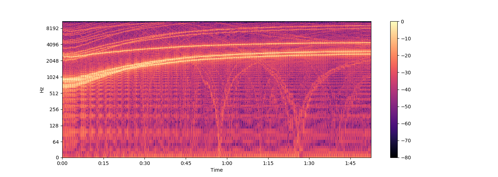
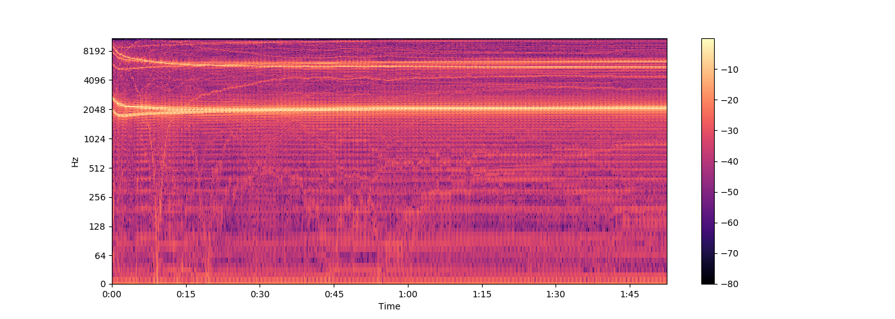

# Gradient Sonification Keras Callback
 Keras Callback for Auralization of Gradient Norms

Inspired heavily by [Christian Perone's blog post and Pytorch implementation](http://blog.christianperone.com/2019/08/listening-to-the-neural-network-gradient-norms-during-training/)

##### DNN SGD 0.01 ReLU


##### DNN SGD 0.01 Linear


##### DNN SGD 0.01 Sigmoid


##### DNN SGD 0.01 Tanh


#### Comments
A loop was performed over the parameter space below to further analyze the differences. Notably the most interesting result is when tweaking the activation function and optimizer.

```
model = [CNN, DNN]
learning_rates = [1.0, 0.1, 0.01,]
optimizers = [SGD, Adam, RMSprop, Adadelta]
activations = ['relu', 'linear', 'sigmoid', 'tanh']
```

#### 1. Setup and compile your model
```python
model = Sequential([...])
model.compile(loss='categorical_crossentropy',
              optimizer=opt(lr=lr),
              metrics=['accuracy'])     
```

#### 2. Define the callback
```python
from callbacks import GradientSonification

fs = 44100
duration = 0.01
freq = 200.0

grad_son = GradientSonification(path='sample',
                                model=model,
                                fs=fs,
                                duration=duration,
                                freq=freq,
                                plot=True)                     
```

#### 3. Recompile your model with the new metrics
```python
model.compile(loss='categorical_crossentropy',
              optimizer=opt(lr=lr),
              metrics=['accuracy'] + grad_son.metrics)    
```

#### 4. Have you model.fit today?
```python
model.fit(X_train, y_train,
          batch_size=32,
          epochs=5,
          callbacks=[grad_son])
```

#### 5. After training is complete, the output files should be like that of sample.wav and sample.png which represents the audio and spectrogram files, respectively.
